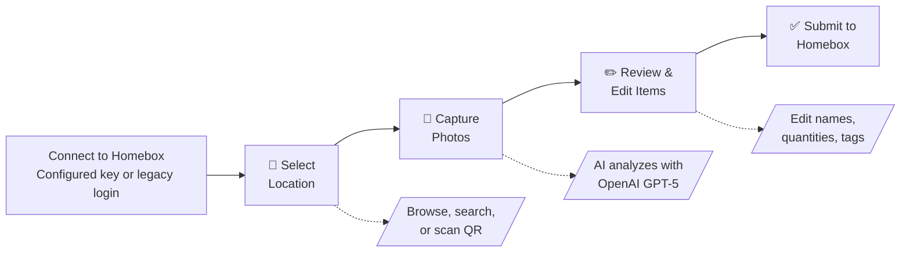

<h1 align="center" style="margin-top: -10px;"></h1>

<div align="center">
  <a href="#"></a>
</div>

<h1 align="center" style="margin-top: -10px;"> Homebox Companion </h1>

> **Not affiliated with the Homebox project.** This is an unofficial third-party companion app.

AI-powered companion for [Homebox](https://github.com/sysadminsmedia/homebox) inventory management.
<table align="center">
  <tr>
    <td></td>
    <td></td>
    <td></td>
    <td></td>
  </tr>
</table>

Take a photo of your stuff, and let AI identify and catalog items directly into your Homebox instance. Perfect for quickly inventorying a room, shelf, or collection.
Use the **AI Chat** to manage your inventory, find locations, or update details just by asking.

<div align="center">
  <a href="https://demo.hbcompanion.duelion.com/" target="_blank">
    
  </a>
  <br>
  <sub><i>AI Chat is disabled in demo mode.</i></sub>
</div>

## 🔄 How It Works



1. **Connect** – Enter directly with a configured Homebox API key, or use your existing Homebox credentials when no key is configured
2. **Select Location** – Browse the location tree, search, or scan a Homebox QR code
3. **Capture Photos** – Take or upload photos of items (supports multiple photos per item)
4. **AI Detection** – AI vision (via LiteLLM*) identifies items, quantities, and metadata
5. **Review & Edit** – Adjust AI suggestions or ask AI to correct mistakes
6. **Submit** – Items are created in your Homebox inventory with photos attached

> *LiteLLM is a Python adaptor library we use to call OpenAI directly, no Local AI model required (unless you want to), just your API key.

## 💰 OpenAI Cost Estimates

**GPT-5 mini** (default) offers the best accuracy. **GPT-5 nano** is 3x cheaper but may need more corrections. Typical cost: **~$0.30 per 100 items** (mini) or **~$0.10 per 100 items** (nano).

*Prices as of **2025-12-10**, using OpenAI’s published pricing for GPT-5 mini and GPT-5 nano.*

## 📋 Requirements

Before you start, you'll need:

- **An OpenAI API key** – Get one at [platform.openai.com](https://platform.openai.com/api-keys)
- **A Homebox instance** – Your own [Homebox](https://github.com/sysadminsmedia/homebox) server, or use the [demo server](#try-with-demo-server) to test

> **Compatibility:** Integration tests use Homebox v0.26.2. Homebox API keys require v0.26.0 or newer; retaining legacy login does not add support for older inventory APIs.

## 🚀 Quick Start

### Try with Demo Server

Want to try it out without setting up Homebox? Use the public demo server:

```bash
docker run -p 8000:8000 \
  -e HBC_LLM_API_KEY=sk-your-key \
  -e HBC_HOMEBOX_URL=https://demo.homebox.software \
  ghcr.io/duelion/homebox-companion:latest
```

Open `http://localhost:8000` and login with `demo@example.com` / `demo`

### Docker (Recommended)

```yaml
# docker-compose.yml
services:
  homebox-companion:
    image: ghcr.io/duelion/homebox-companion:latest
    container_name: homebox-companion
    restart: always
    environment:
      - HBC_LLM_API_KEY=sk-your-api-key-here
      - HBC_HOMEBOX_URL=http://your-homebox-ip:7745
      - HBC_HOMEBOX_API_KEY=${HBC_HOMEBOX_API_KEY:-}
    ports:
      - 8000:8000
```

```bash
docker compose up -d
```

Open `http://localhost:8000` in your browser.

> **Tip:** If Homebox runs on the same machine but outside Docker, use `http://host.docker.internal:PORT` as the URL.

If Homebox runs in another Compose service, put both services on the same Docker
network and use the Homebox service name, for example `http://homebox:7745`.
`localhost` from inside the Companion container refers to the Companion
container itself.

> **ARM64/Raspberry Pi:** Docker images are built for both `linux/amd64` and `linux/arm64` architectures.

### Homebox API key or legacy login

To enter Companion without a login screen, create a key in **Homebox → Profile → API Keys** and copy its one-time token. Set it on the Companion server:

```dotenv
HBC_HOMEBOX_URL=http://your-homebox-ip:7745
HBC_HOMEBOX_API_KEY=hb_your_homebox_issued_key
```

Restart Companion after changing these values. With Docker Compose, keep the explicit `HBC_HOMEBOX_API_KEY` environment entry shown above and run `docker compose up -d --force-recreate`. A Compose `.env` file supplies interpolation values; it does not automatically pass every variable into the container.

A configured key is used only by the server. The browser receives no Homebox key and has no login, session refresh or Homebox logout action. Missing, empty or whitespace-only keys preserve the username/password flow. An invalid, expired or revoked key shows a connection error with Retry; it never falls back to a password prompt. Removing the key and restarting restores legacy login.

All people who can reach a key-mode deployment act as the key's Homebox owner. Use a dedicated Homebox user with the intended collection permissions and control access through your network or reverse proxy. Browser chat contexts separate conversation history and pending approvals; they are not accounts or access credentials. Existing contextless chats and scan drafts remain stored, but are not loaded automatically into a newly verified context. Clearing browser data creates a new chat context. Server chat state remains in memory with its existing TTL and requires a single worker for consistent conversations.

To rotate a key, create a replacement in Homebox, update the server environment, restart Companion and verify its connection, then revoke the old key in Homebox. Companion does not refresh or revoke API keys. Homebox v0.26.x requires its own stable `HBOX_AUTH_API_KEY_PEPPER` of at least 32 bytes; configure that on **Homebox**, never on Companion. See [Homebox configuration](https://github.com/sysadminsmedia/homebox/blob/e01dd737238a3fa7e1a6454b37de6c6fc88c86e4/docs/src/content/docs/en/quick-start/configure/index.mdx).

### Shared settings

Authenticated Homebox users can manage shared settings, AI model profiles, custom fields and server logs without additional account configuration. In API-key mode, access uses the configured key's Homebox identity. Homebox credentials are revalidated when accessing Companion's local settings and logs.

When editing an AI profile, leave the API key blank to keep its saved key, including when changing the model or API base URL. A primary profile without a key uses the configured environment default; a fallback without a key inherits the primary key. Set a profile's own key when it needs different credentials.

## ✨ Features

### AI-Powered Detection
- Identifies multiple items in a single photo
- Extracts manufacturer, model, serial number, price when visible
- Suggests tags from your existing Homebox tags
- Multi-language support

### Smart Workflow
- **Multi-image analysis** – Take photos from multiple angles for better accuracy
- **Single-item mode** – Force AI to treat a photo as one item (for sets/kits)
- **AI corrections** – Tell the AI what it got wrong and it re-analyzes
- **Custom thumbnails** – Crop and select the best image for each item

### Location Management
- Browse hierarchical location tree
- Search locations by name
- Scan Homebox QR codes
- Create new locations on the fly

### Customization
- Configure how AI formats each field (name style, description format, etc.)
- Set a default tag for all detected items
- Define custom Homebox fields with AI instructions (the AI populates them during detection)

### Chat Assistant
- **Natural language queries** – Ask questions like "How many items do I have?" or "List my tags"
- **Inventory actions** – Create, update, move, or delete items through conversation
- **Approval workflow** – Review and approve AI-proposed changes before they're applied
- **Streaming responses** – Real-time AI responses with tool execution feedback

<details>
<summary>Available Tools</summary>

The chat assistant has access to 24 tools for interacting with your Homebox inventory:

**Read-Only** (auto-execute):
| Tool | Description |
|------|-------------|
| `list_locations` | List all locations |
| `get_location` | Get location details with children |
| `list_tags` | List all tags |
| `list_items` | List items with filtering/pagination |
| `search_items` | Search items by text query |
| `get_item` | Get full item details |
| `get_item_by_asset_id` | Look up item by asset ID |
| `get_item_path` | Get item's full location path |
| `get_location_tree` | Get hierarchical location tree |
| `get_statistics` | Get inventory statistics |
| `get_statistics_by_location` | Item counts by location |
| `get_statistics_by_tag` | Item counts by tag |
| `get_attachment` | Get attachment content |

**Write** (requires approval):
| Tool | Description |
|------|-------------|
| `create_item` | Create a new item |
| `update_item` | Update item fields |
| `create_location` | Create a new location |
| `update_location` | Update location details |
| `create_tag` | Create a new tag |
| `update_tag` | Update tag details |
| `upload_attachment` | Upload attachment to item |
| `ensure_asset_ids` | Assign asset IDs to all items |

**Destructive** (requires approval):
| Tool | Description |
|------|-------------|
| `delete_item` | Delete an item |
| `delete_location` | Delete a location |
| `delete_tag` | Delete a tag |

</details>

## 🤖 LLM Provider Support

Homebox Companion uses [LiteLLM](https://docs.litellm.ai/) as a Python library to call AI providers. **You don't need to self-host anything** – just get an OpenAI API key from [platform.openai.com](https://platform.openai.com/api-keys) and you're ready to go. We officially support and test with OpenAI GPT models only.

> **Fallback Support:** You can configure a secondary LLM profile in Settings that automatically activates if your primary provider fails.

<details>
<summary>Officially Supported Models</summary>

- **GPT-5 mini** (default) – Recommended for best balance of speed and accuracy
- **GPT-5 nano**

</details>

<details>
<summary>Using Other Providers (Experimental)</summary>

You can try other LiteLLM-compatible providers at your own risk. The app checks if your chosen model supports the required capabilities using LiteLLM's API:

**Required capabilities (photo scanning):**
- **Vision** – Checked via `litellm.supports_vision(model)`
- **Structured outputs** – Checked via `litellm.supports_response_schema(model)`

**Required for Chat assistant (in addition to the above):**
- **Function calling** – Checked via `litellm.supports_function_calling(model)`. Models without native tool calling (e.g., `llava`, `moondream`) will work for photo scanning but **not** for the Chat assistant, which relies on tool calls to query your inventory.

**Finding model names:**

Model names are passed directly to LiteLLM. Use the exact names from LiteLLM's documentation:
- [LiteLLM Supported Models](https://docs.litellm.ai/docs/providers)

Common examples:
- OpenAI: `gpt-4o`, `gpt-4o-mini`, `gpt-5-mini`
- Anthropic: `claude-sonnet-4-5`, `claude-3-5-sonnet-20241022`

> **Note:** Model names must exactly match LiteLLM's expected format. Typos or incorrect formats will cause errors. Check [LiteLLM's provider documentation](https://docs.litellm.ai/docs/providers) for the correct model names.

**Running Local Models:**

You can run models locally using tools like [Ollama](https://ollama.ai/), [LM Studio](https://lmstudio.ai/), or [vLLM](https://docs.vllm.ai/). See [LiteLLM's Local Server documentation](https://docs.litellm.ai/docs/providers/ollama) for setup instructions.

Once your local server is running, configure the app:

```bash
HBC_LLM_API_KEY=any-value-works-for-local  # Just needs to be non-empty
HBC_LLM_API_BASE=http://localhost:11434     # Your local server URL
HBC_LLM_MODEL=ollama/llava:34b              # Your local model name
HBC_LLM_ALLOW_UNSAFE_MODELS=true            # Required for most local models
```

**Note:** Local models must support vision for photo scanning (e.g., llava, bakllava, moondream). For the **Chat assistant**, the model must also support **function calling** — most vision-only models do not. Check your model's capabilities with `litellm.supports_function_calling("ollama/your-model")`. Performance and accuracy vary widely.

**⚠️ Important:** Other providers (Anthropic, Google, OpenRouter, local models, etc.) are **not officially supported**. If you encounter errors, we may not be able to help. Use at your own risk.

</details>

## ⚙️ Configuration

> **📝 Full reference:** See [`.env.example`](.env.example) for all available environment variables with detailed explanations and examples.

### Essential Settings

For a quick setup, you only need to provide your OpenAI API key. All other settings have sensible defaults.

| Variable | Required | Description |
|----------|----------|-------------|
| `HBC_LLM_API_KEY` | **Yes** | Your OpenAI API key |
| `HBC_HOMEBOX_URL` | No | Your Homebox instance URL (defaults to demo server) |
| `HBC_HOMEBOX_API_KEY` | No | Homebox-issued key for direct entry; empty retains legacy login. Server-only; restart after changing. |
| `HBC_LINK_BASE_URL` | No | Public URL for Homebox links in chat (defaults to `HBC_HOMEBOX_URL`) |
| `HBC_COMPANION_BASE_URL` | No | Public URL for companion app item links in chat responses (required for shareable links; defaults to relative paths) |

<details>
<summary>⚙️ Full Configuration Reference</summary>

| Variable | Default | Description |
|----------|---------|-------------|
| `HBC_LLM_MODEL` | `gpt-5-mini` | Model to use. Supported: `gpt-5-mini`, `gpt-5-nano`. |
| `HBC_LLM_API_BASE` | – | Custom API base URL (for proxies or experimental providers) |
| `HBC_LLM_ALLOW_UNSAFE_MODELS` | `false` | Skip capability validation for unrecognized models |
| `HBC_LLM_TIMEOUT` | `120` | LLM request timeout in seconds |
| `HBC_LLM_STREAM_TIMEOUT` | `300` | Streaming timeout for large responses (e.g., hierarchical views) |
| `HBC_MAX_UPLOAD_SIZE_MB` | `20` | Maximum bytes per file, expressed in MiB; must be positive. |
| `HBC_MAX_REQUEST_SIZE_MB` | `100` | Maximum aggregate API request body in MiB, including all files and multipart overhead; enforced while streaming, before parsing can exceed the limit. Must be positive. |
| `HBC_IMAGE_QUALITY` | `medium` | Image quality for Homebox uploads: `raw`, `high`, `medium`, `low` |

</details>

### Advanced Settings

Requests exceeding the body limit return HTTP 413, including chunked uploads. Missing or malformed legacy bearer credentials are rejected before multipart files are read. Configure matching body and concurrency limits on your reverse proxy to bound simultaneous uploads as well. If legitimate multi-image requests exceed 100 MiB, raise `HBC_MAX_REQUEST_SIZE_MB` deliberately; the per-file limit still applies.

<details>
<summary>Image Quality</summary>

Control compression applied to images uploaded to Homebox. Compression happens server-side during AI analysis to avoid slowing down mobile devices.

| Quality Level | Max Dimension | JPEG Quality | File Size | Use Case |
|--------------|---------------|--------------|-----------|----------|
| `raw` | No limit | Original | Largest | Full quality originals |
| `high` | 2560px | 85% | Large | Best quality, moderate size |
| `medium` | 1920px | 75% | Moderate | **Default** - balanced |
| `low` | 1280px | 60% | Smallest | Faster uploads, smaller storage |

**Example:**
```bash
HBC_IMAGE_QUALITY=high
```

**Note:** This setting only affects images uploaded to Homebox. AI analysis always uses optimized images regardless of this setting.

</details>

<details>
<summary>Capture Limits</summary>

| Variable | Default | Description |
|----------|---------|-------------|
| `HBC_CAPTURE_MAX_IMAGES` | `30` | Maximum photos per capture session |
| `HBC_CAPTURE_MAX_FILE_SIZE_MB` | `10` | Maximum file size per image in MB |

**Note:** These are experimental settings. It's advisable to keep the default values to minimize data loss risk during capture sessions.

</details>

<details>
<summary>Rate Limiting</summary>

| Variable | Default | Description |
|----------|---------|-------------|
| `HBC_RATE_LIMIT_ENABLED` | `true` | Enable/disable API rate limiting |
| `HBC_RATE_LIMIT_RPM` | `400` | Requests per minute (80% of Tier 1 limit) |
| `HBC_RATE_LIMIT_TPM` | `400000` | Tokens per minute (80% of Tier 1 limit) |
| `HBC_RATE_LIMIT_BURST_MULTIPLIER` | `1.5` | Burst capacity multiplier |

**Note:** Default settings are conservative (80% of OpenAI Tier 1 limits). Only configure if you have a higher-tier account or need to adjust limits.

**Examples for different OpenAI tiers:**
- Tier 2: `HBC_RATE_LIMIT_RPM=4000` `HBC_RATE_LIMIT_TPM=1600000`
- Tier 3: `HBC_RATE_LIMIT_RPM=4000` `HBC_RATE_LIMIT_TPM=3200000`

</details>

<details>
<summary>Server & Logging</summary>

| Variable | Default | Description |
|----------|---------|-------------|
| `HBC_SERVER_HOST` | `0.0.0.0` | Server bind address |
| `HBC_SERVER_PORT` | `8000` | Server port |
| `HBC_LOG_LEVEL` | `INFO` | Logging level |
| `HBC_DISABLE_UPDATE_CHECK` | `false` | Disable update notifications |
| `HBC_MAX_UPLOAD_SIZE_MB` | `20` | Maximum file upload size in MB |
| `HBC_CORS_ORIGINS` | `*` | Explicit allowed origins, comma-separated. Wildcard applies only in legacy mode; key mode defaults to same-origin. |

</details>

<details>
<summary>🔒 Security Considerations (Production)</summary>

When deploying to production, review these security settings:

| Variable | Default | Production Recommendation |
|----------|---------|---------------------------|
| `HBC_CORS_ORIGINS` | `*` | Set to specific origins (e.g., `https://your-domain.com`) |
| `HBC_AUTH_RATE_LIMIT_RPM` | `10` | Login attempts per minute per IP (brute-force protection) |
| `HBC_CHAT_RATE_LIMIT_RPM` | `20` | Chat messages per minute per IP (LLM cost protection) |

**CORS Example:**
```bash
# Allow only your frontend domain
HBC_CORS_ORIGINS=https://inventory.example.com

# Multiple origins (comma-separated)
HBC_CORS_ORIGINS=https://inventory.example.com,https://admin.example.com
```

> **Note:** In legacy mode, `HBC_CORS_ORIGINS=*` allows any origin. API-key mode ignores the wildcard and permits same-origin requests plus explicitly listed origins. For a separate development frontend or reverse proxy, list its browser-facing origin. CORS and request-origin checks do not replace network or proxy access control.

</details>

<details>
<summary>🖨️ Label Printing</summary>

| Variable | Default | Description |
|----------|---------|-------------|
| `HBC_PRINT_ENABLED` | `false` | Show a "Print Label" button after items are created |

When enabled, a print button appears on the post-creation screen for each item. Pressing it triggers Homebox's built-in labelmaker, which generates and prints a label via the command configured on your **Homebox server**.

**Homebox server prerequisite:** Set the `HBOX_LABEL_MAKER_PRINT_COMMAND` environment variable on your Homebox instance (e.g., `lp -d MyPrinter %s`). Without it, print requests will fail. See [Homebox documentation](https://github.com/sysadminsmedia/homebox) for details.

</details>

<details>
<summary>AI Output Customization</summary>

Customize how AI formats detected item fields. Set via environment variables or the Settings page (UI takes priority).

| Variable | Description |
|----------|-------------|
| `HBC_AI_OUTPUT_LANGUAGE` | Language for AI output (default: English) |
| `HBC_AI_DEFAULT_TAG_ID` | Tag ID to auto-apply to all items |
| `HBC_AI_NAME` | Custom instructions for item naming |
| `HBC_AI_DESCRIPTION` | Custom instructions for descriptions |
| `HBC_AI_QUANTITY` | Custom instructions for quantity counting |
| `HBC_AI_MANUFACTURER` | Instructions for manufacturer extraction |
| `HBC_AI_MODEL_NUMBER` | Instructions for model number extraction |
| `HBC_AI_SERIAL_NUMBER` | Instructions for serial number extraction |
| `HBC_AI_PURCHASE_PRICE` | Instructions for price extraction |
| `HBC_AI_PURCHASE_FROM` | Instructions for retailer extraction |
| `HBC_AI_NOTES` | Custom instructions for notes |
| `HBC_AI_NAMING_EXAMPLES` | Example names to guide the AI |

</details>

## 💡 Tips

- **Batch more items for faster uploads** – Images are analyzed by AI in parallel (up to 30 simultaneously), so adding more items actually feels faster than one at a time.
- **Include receipts in your photos** – AI can extract purchase price, retailer, and date from receipt images.
- **Multiple angles = better results** – Include close-ups of labels, serial numbers, or barcodes for more accurate detection.
- **HTTPS required for QR scanning** – Native camera QR detection only works over HTTPS. On HTTP, a "Take Photo" fallback is available.
- **Use the Settings page** – Customize AI behavior, define custom fields, and manage LLM profiles without restarting.
- **Long press to confirm all** – On the review screen, long-press the confirm button to accept all remaining items at once.

## Development

Target recovery contributions at `dev`. Changes on `dev` are not yet a release;
promotion to `main` and publishing are separate steps.

Use Python 3.14+, Node 22, uv 0.9.17+ (CI and Docker use 0.12.5), and locked installs:

```bash
uv sync --locked
cd frontend
npm ci
```

The PR and `dev` CI workflow runs Python checks, frontend checks, mocked browser
tests, and disposable Homebox integration tests. See [tests/README.md](tests/README.md)
for local commands and Docker/browser prerequisites. These suites require no paid
LLM calls.

For a deliberate Python dependency refresh, run
`uv sync --upgrade --exclude-newer "30 days"` with a uv version that supports
relative durations (0.9.17+). This applies the cooldown only to that refresh;
routine installs use the committed lockfile with `uv sync --locked`.
For frontend updates, verify selected releases and transitive dependencies are
at least 30 days old, update the lockfile, and rerun the checks and `npm audit`.

## 📄 License

This project is licensed under the GNU General Public License v3.0 - see the [LICENSE](LICENSE) file for details.

## 🙏 Acknowledgments

- [Homebox](https://github.com/sysadminsmedia/homebox) – The inventory system this app extends
- [OpenAI](https://openai.com) – Vision AI capabilities (GPT models)
- [LiteLLM](https://docs.litellm.ai/) – LLM provider abstraction layer
- [FastAPI](https://fastapi.tiangolo.com) & [SvelteKit](https://kit.svelte.dev) – Backend & frontend frameworks
<p align="center"> <a href="https://buymeacoffee.com/duelion" target="_blank" rel="noopener noreferrer">  </a> </p>
